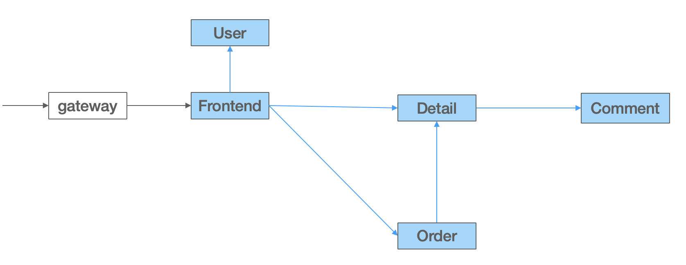
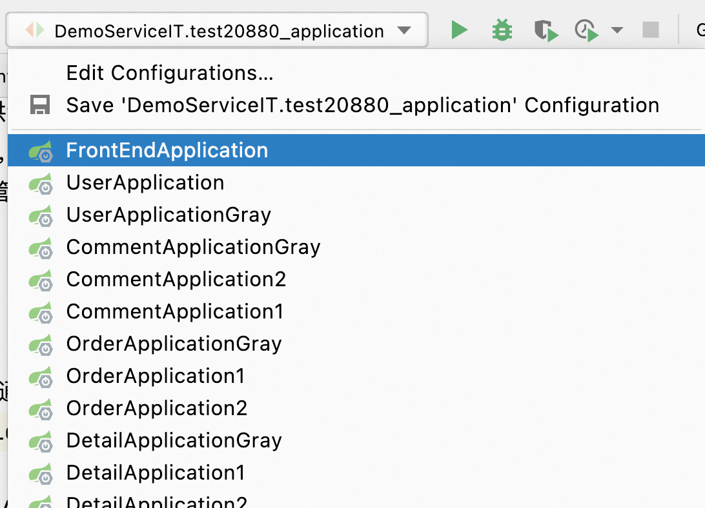
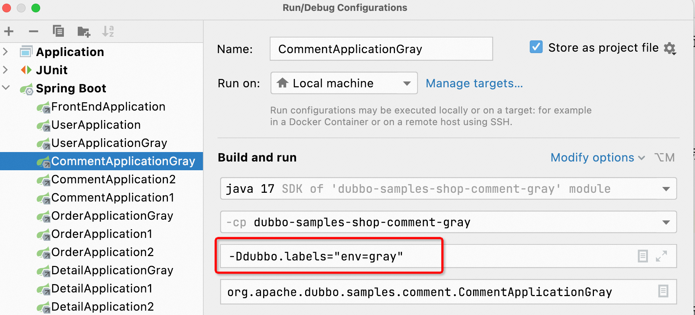
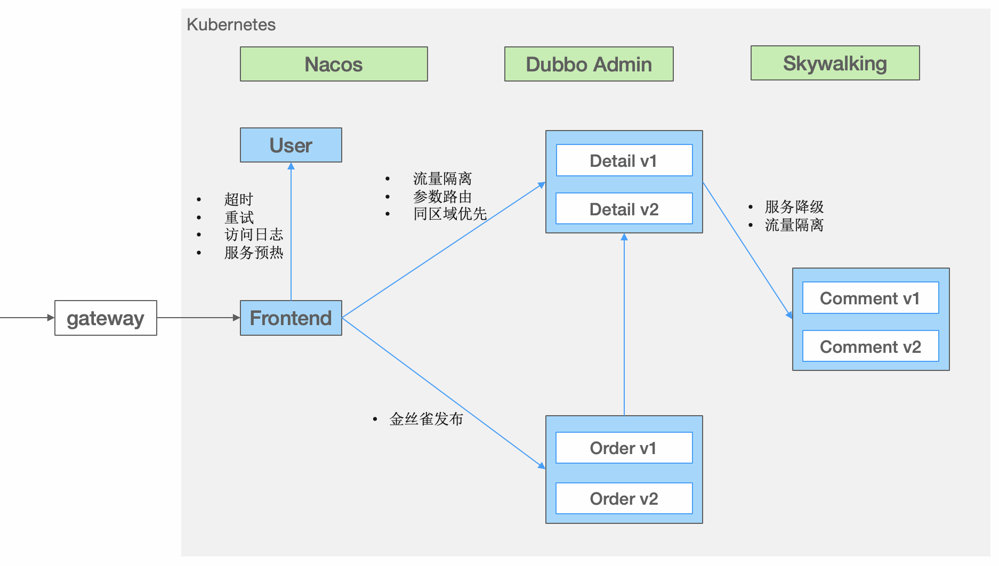

此任务基于一个简单的线上商城微服务系统演示了 Dubbo 的流量管控能力。用于配合 [【Dubbo 官网】-【文档】-【任务】-【流量管控】](https://cn.dubbo.apache.org/zh-cn/overview/tasks/traffic-management/)部分文档。

## 架构
线上商城的架构图如下：



系统由 5 个微服务应用组成：
* `Frontend 商城主页`，作为与用户交互的 web 界面，通过调用 `User`、`Detail`、`Order` 等提供用户登录、商品展示和订单管理等服务。
* `User 用户服务`，负责用户数据管理、身份校验等。
* `Order 订单服务`，提供订订单创建、订单查询等服务，依赖 `Detail` 服务校验商品库存等信息。
* `Detail 商品详情服务`，展示商品详情信息，调用 `Comment` 服务展示用户对商品的评论记录。
* `Comment 评论服务`，管理用户对商品的评论数据。

## 部署商场系统
配合官网的流量管控任务，有两种模式可以启动商城系统并进行流量管控
1. 本地 IDE 运行任务，根据当前的流量管控动作按需要启动相关的应用进程
2. 通过部署 Kubernetes 资源一次性拉起所有应用进程

### 本地 IDE 部署
把当前项目导入 IDEA 后，通过点击 IDEA 上方的可运行命令列表，可以看到一系列预先配置好的可运行 Shop 子任务示例，比如 `FrontEndApplication`、`UserApplication` 等。



这些预先配置的可运行任务都已经被正确的打标，比如 `CommentApplicationGray` 的配置如下图所示，因此，如果直接运行
`CommentApplicationGray`，则启动的进程将自动带有 `env=gray` 的标签。



接下来，你就可以跟随 [Dubbo 官网描述的任务](https://cn.dubbo.apache.org/zh-cn/overview/tasks/traffic-management/)，启动相应的任务示例，并运行查看效果。

> 注意，要成功的在本地运行这里的示例，还需要先在本地启动 Nacos 注册中心，最好再部署 Dubbo Admin 等以方便进行规则配置。

### Kubernetes 部署

为方便起见，推荐将整个系统部署在 Kubernetes 集群，执行以下命令即可完成商城项目部署，项目源码示例在 [dubbo-samples/task](https://github.com/apache/dubbo-samples/tree/master/10-task/dubbo-samples-shop)。

```sh
kubectl apply -f https://raw.githubusercontent.com/apache/dubbo-samples/master/10-task/dubbo-samples-shop/deploy/All.yml
```

完整的部署架构图如下：



`Order 订单服务`有两个版本 `v1` 和 `v2`，`v2` 是订单服务优化后发布的新版本。
* 版本 v1 只是简单的创建订单，不展示订单详情
* 版本 v2 在订单创建成功后会展示订单的收货地址详情

`Detail` 和 `Comment` 服务也分别有两个版本 `v1` 和 `v2`，我们通过多个版本来演示流量导流后的效果。
* 版本 `v1` 默认为所有请求提供服务
* 版本 `v2` 模拟被部署在特定的区域的服务，因此 `v2` 实例会带有特定的标签
