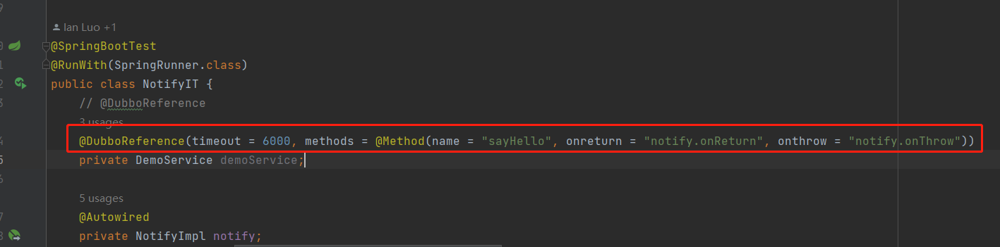
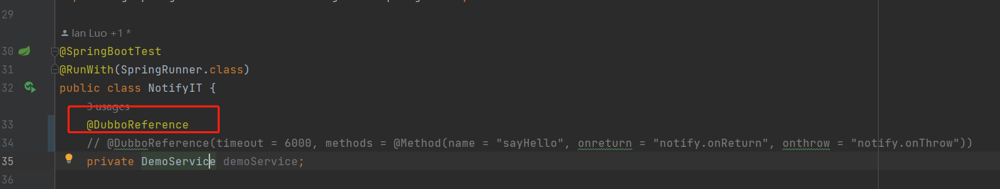
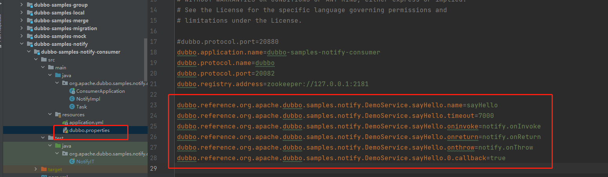
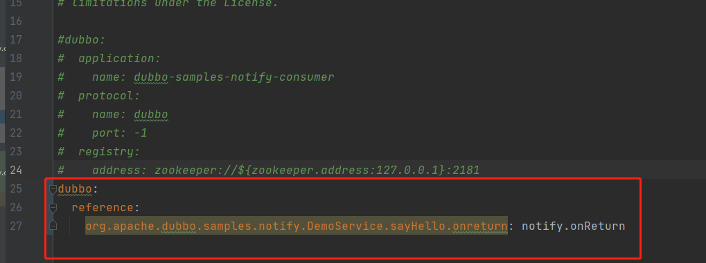

# 三种方式使用`dubbo`的`notify`功能
## 使用背景
`Consumer`端调用远程服务后，如果希望在`方法执行后`，`正常返回后`，`出现异常后`做一些额外的处理逻辑，可以分别通过配置方法的`oninvoke`、`onreturn`、`onthrow`属性来执行对应的逻辑处理，这里介绍三种配置方式。
## 方式一
在`Consumer`端使用`@DubboReference`纯注解方式配置事件通知，该方法是在`@DubboReference`注解中直接配置`oninvoke`、`onreturn`、`onthrow`属性。经过测试，这种方法是成功的，对应的示例如下:

> 注意: 示例中的属性值`notify.onReturn`，表示如果正常返回则会执行名字为`notify`的`bean`的`onReturn`方法，其他属性值意义类似。

## 方式二
尝试使用`注解+properties`方式

> 注意：这种方式是失败的，不会执行配置的事件通知方法，后续会验证为什么不可以。

首先只使用了`@DubboReference`注解，然后在`dubbo.properties`中配置了对应的事件通知方法，具体如下：

## 方式三
尝试在`application.yml`文件中配置，也是失败的，目前`dubbo3`还不支持在`yml`中配置事件通知方法。

