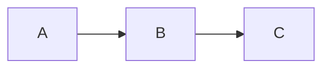

#### 介绍

Dubbo Security 是基于spring security构建的rpc通信鉴权模块,遵循spring security安全配置,通过Spring security context 授权信息完成客户端与服务端的授权访问。

#### 服务调用



+ 场景(一): A, B, C 依赖 dubbo-spring-security, B,C 启用授权验证，在调用过程中 B 首先进行授权检查，验证成功后调用C进行验证。

+ 场景(二): A,C 依赖 dubbo-spring-security，A调用B，B在调用C的过程中会透传授权信息，C接收到授权信息进行授权验证。

#### 核心依赖

```xml
<dependencyManagement>
    <dependencies>
        <dependency>
            <groupId>org.apache.dubbo</groupId>
            <artifactId>dubbo-dependencies-bom</artifactId>
            <version>${dubbo.dependencies.version}</version>
            <type>pom</type>
            <scope>import</scope>
        </dependency>

        <dependency>
            <groupId>org.apache.dubbo</groupId>
            <artifactId>dubbo-bom</artifactId>
            <version>${dubbo.version}</version>
            <type>pom</type>
            <scope>import</scope>
        </dependency>
    </dependencies>
</dependencyManagement>

<dependency>
    <groupId>org.apache.dubbo</groupId>
    <artifactId>dubbo-spring-security</artifactId>
</dependency>

<dependency>
   <groupId>org.springframework.security</groupId>
    <artifactId>spring-security-config</artifactId>
</dependency>

```

#### provider 启用 Security 配置

```java
@EnableGlobalMethodSecurity(prePostEnabled = true, securedEnabled = true)
public class ProviderApplication {

}
```

+ 具体案例参考dubbo-samples

### 自定义序列化

+ 添加配置类。

```java
@Configuration
public class SecuritySerializationConfig {

    @Bean
    public DefaultObjectMapperCodecCustomer objectMapperCodecCustomer() {
        return new DefaultObjectMapperCodecCustomer();
    }
}
```

+ 自定义实现代码

```java
public class DefaultObjectMapperCodecCustomer implements ObjectMapperCodecCustomer {
    @Override
    public void customize(ObjectMapperCodec objectMapperCodec) {

       //Add custom codec
    }
}
```

#### 备注：

+ 大多数Spring Security的Authentication对象实现都使用了带参数的构造函数。如果您要自定义Authentication对象并使用带参数的构造函数，那么在反序列化时必须为ObjectMapper注册反序列化器。在Dubbo应用中，你可以扩展ObjectMapperCodecCustomer注册序列化和反序列化对象。

+ 如果没有自定义实现反序列化器产生的错误，dubbo 会忽略当前错误

+ 在Spring Security 中，自定义反序列器可以参考`UsernamePasswordAuthenticationTokenDeserializer`
