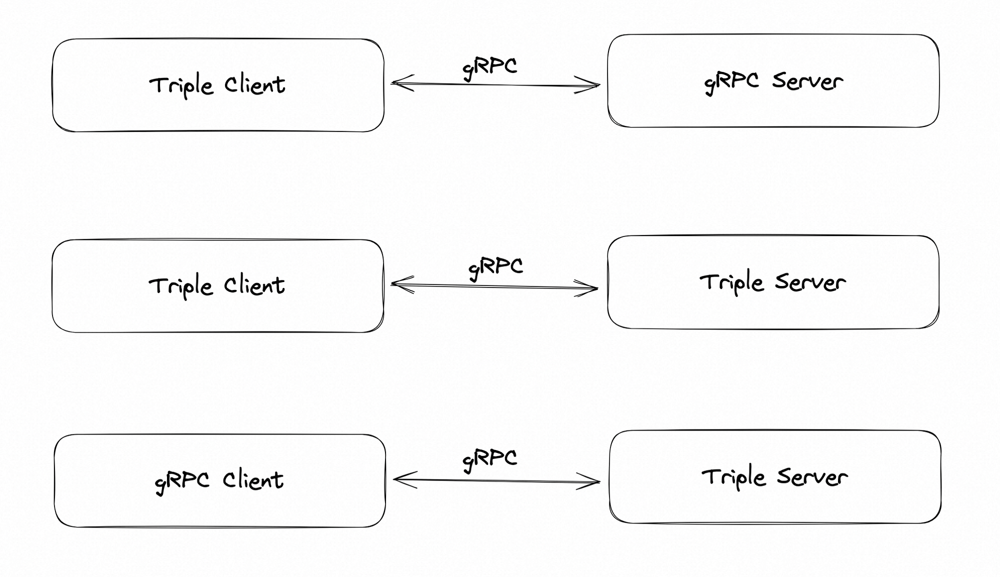

This example shows how you can use triple protocol to do interoperate with standard gRPC.



As described in [the Triple protocol documentation](https://dubbo.apache.org/zh-cn/overview/reference/protocols/triple/), Dubbo triple protocol is a better gRPC implementation which can be accessed by cURL and web browsers directly.

## Serve As Standard gRPC Server
This part showcases how standard gRPC client written with gRPC-java consumes Triple protocol service written with Dubbo.

### Start a Dubbo server
Make sure you are in `dubbo-samples-triple-grpc` directory and then run the following command:

```shell
$ mvn compile exec:java -Dexec.mainClass="org.apache.dubbo.samples.tri.grpc.interop.server.TriOpServer"
```

### Call Triple server with standard gRPC client
Open a new terminal, enter `dubbo-samples-triple-grpc` directory and then run the following command:

```shell
$ mvn compile exec:java -Dexec.mainClass="org.apache.dubbo.samples.tri.grpc.interop.server.GrpcClient"
```

## Consume Standard gRPC Server
This part showcases how Triple client written with Dubbo consumes gRPC service written with standard gRPC-java.

### Start a standard gRPC server
```shell
$ mvn compile exec:java -Dexec.mainClass="org.apache.dubbo.samples.tri.grpc.interop.client.GrpcServer"
```

### Call gRPC server with Dubbo client
```shell
$ mvn compile exec:java -Dexec.mainClass="org.apache.dubbo.samples.tri.grpc.interop.client.TriOpClient"
```

