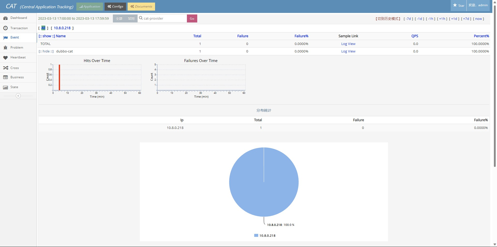
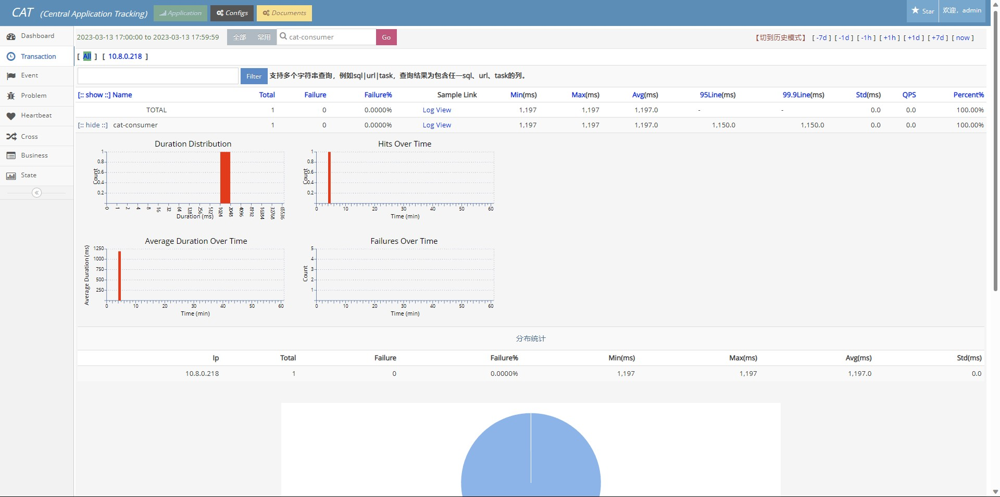
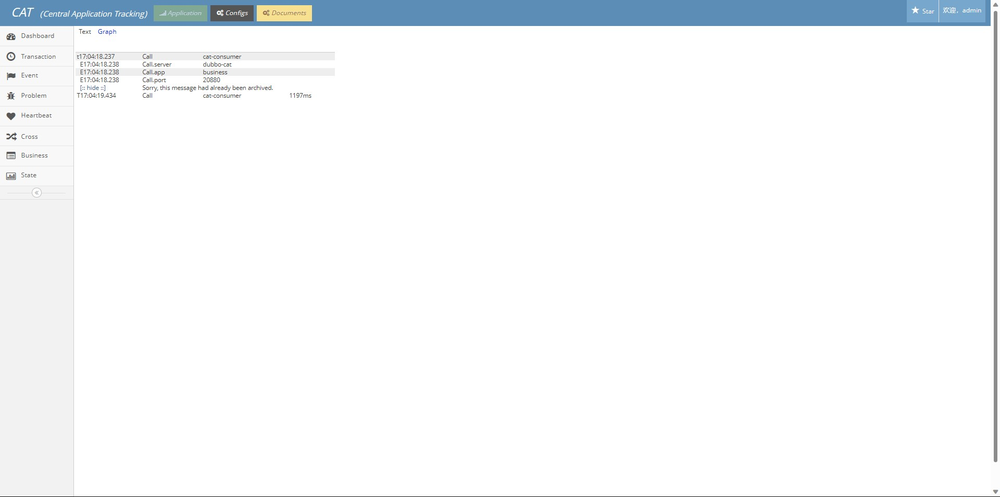

# Overview

This example demonstrates the basic usage of tracing in Dubbo application and report tracing information
to [Cat](https://github.com/dianping/cat/).

## Quick Start

### Start Cat Server

Follow [Cat-Server](https://github.com/dianping/cat/wiki/readme_server) to deploy the server.

### Add Cat-Client Api To Your Project

In client, you should add this toolkit dependency.

```xml

<dependency>
    <groupId>com.dianping.cat</groupId>
    <artifactId>cat-client</artifactId>
    <version>3.0.1</version>
</dependency>
```

Have to be aware of is:

1. When you start service provider or consumer, you should add `-DCAT_HOME=` to specify the path of `client.xml`  in
   VM options to indicate the address of the cat server.
2. In `META-INF`, you should plus domain configuration in the `app.properties` file.

## Result

Open [Cat-Dashboard](http://localhost:8080/cat) in browser.




