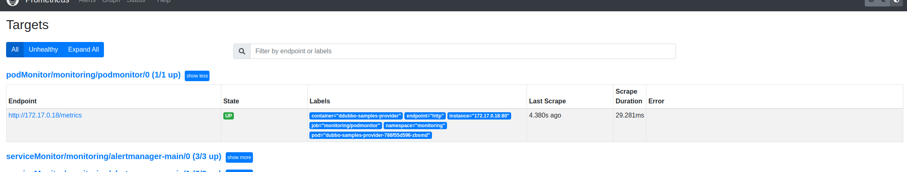

本示例通过[kube-prometheus](https://github.com/prometheus-operator/kube-prometheus)
构建k8s的prometheus环境  
为了方便访问验证可以将`alertmanager-service.yaml``grafana-service.yaml``prometheus-service.yaml`设置为NodePort

1. 添加 `dubboPodMoitor.yaml` 到 `manifests` 目录配置如下如下
 ```yaml
apiVersion: monitoring.coreos.com/v1
kind: PodMonitor
metadata:
  name: podmonitor
  labels:
    app: podmonitor
  namespace: monitoring
spec:
  selector:
    matchLabels:
      app-type: dubbo
  namespaceSelector:
    matchNames:
      - monitoring
  podMetricsEndpoints:
    - port: http
      path: /metrics

```
2.配置`prometheus-prometheus.yaml`添加podMonitorSelector  

```yaml
podMonitorSelector:
  matchLabels:
    app: podmonitor
```
3. 部署prometheus环境  
    详细部署步骤[kube-prometheus](https://github.com/prometheus-operator/kube-prometheus)
4. 使用 `./nacos/nacos.yaml` 部署nacos
5. 使用`./Deployment.yaml` 部署dubbo 应用
6. 打开prometheus查看结果如下
   
 