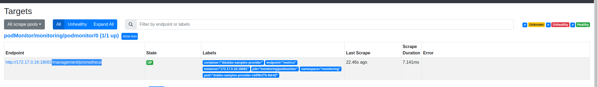
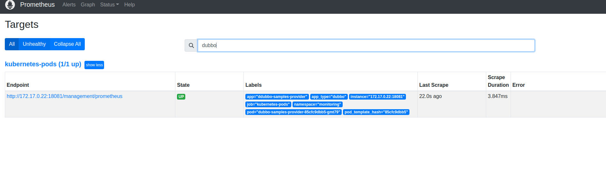

本示例演示如何为 Dubbo 实例开启指标监控，结合 Grafana 和 Prometheus 的完整部署和使用示例请参考 [官方文档](https://cn.dubbo.apache.org/zh-cn/overview/tasks/observability/)。

## 开启 Metrics 数据采集并上报到 Prometheus

Dubbo 支持通过两种方式对外暴露 Metrics 指标给 Prometheus，具体可参见 [官方文档配置说明]()。
* Spring-boot-actuator，即通过标准的 Spring boot actuator 端口在特定的 endpoint 将 Dubbo 监控指标暴露出去
* dubbo qos，即通过 Dubbo 内置的 qos 端口将 Dubbo 监控指标暴露出去

本示例中，我们使用 spring-boot-actuator 的方式透出 Dubbo 指标信息，请注意本示例使用的 Dubbo 版本必须为 3.2.0-beta.6 以上。

### Metrics 相关示例配置

```yaml
# ......
management.server.port=18081
management.endpoints.web.base-path=/management
dubbo.metrics.protocol=prometheus

# 如果不使用 spring-boot-actuator，可使用下面配置开启 qos 配置
# dubbo.metrics.enable-jvm-metrics=true
# dubbo.application.qos-port=22222
# dubbo.application.qos-accept-foreign-ip=true
```

启动 MetricsApplication，测试访问监控指标：http://localhost:18081/management/prometheus

## 部署示例到 Kubernetes
### 采用 kube-prometheus 部署

本示例通过 [kube-prometheus](https://github.com/prometheus-operator/kube-prometheus) 构建k8s的prometheus环境

为了方便访问验证可以将`alertmanager-service.yaml` `grafana-service.yaml` `prometheus-service.yaml`设置为NodePort

1. 添加 `dubboPodMoitor.yaml` 到 `kube-prometheus`的`manifests` 目录。配置如下
 ```yaml
apiVersion: monitoring.coreos.com/v1
kind: PodMonitor
metadata:
  name: podmonitor
  labels:
    app: podmonitor
  namespace: monitoring
spec:
  selector:
    matchLabels:
      app-type: dubbo
  namespaceSelector:
    matchNames:
      - monitoring
  podMetricsEndpoints:
    - port: metrics #这里需要通过端口名绑定
      path: /management/prometheus

```
2. 配置`prometheus-prometheus.yaml`添加podMonitorSelector  

```yaml
podMonitorSelector:
  matchLabels:
    app: podmonitor
```
3. 部署prometheus环境  
    详细部署步骤[kube-prometheus](https://github.com/prometheus-operator/kube-prometheus)
4. 使用`./Deployment.yaml` 部署dubbo 应用
5. 打开prometheus查看结果如下
   


### 采用 helm-charts 部署

1. 部署[prometheus](https://github.com/prometheus-community/helm-charts/tree/main/charts/prometheus)
2. 修改Deployment.yml 并部署
 ```yaml
     annotations:
        prometheus.io/scrape: "true"
        prometheus.io/path: /management/prometheus 
        prometheus.io/port: "18081"
 ```
3. 打开prometheus查看结果如下
```shell
 export POD_NAME=$(kubectl get pods --namespace default -l "app=prometheus,component=server" -o jsonpath="{.items[0].metadata.name}")
  kubectl --namespace default port-forward $POD_NAME 9090
```
