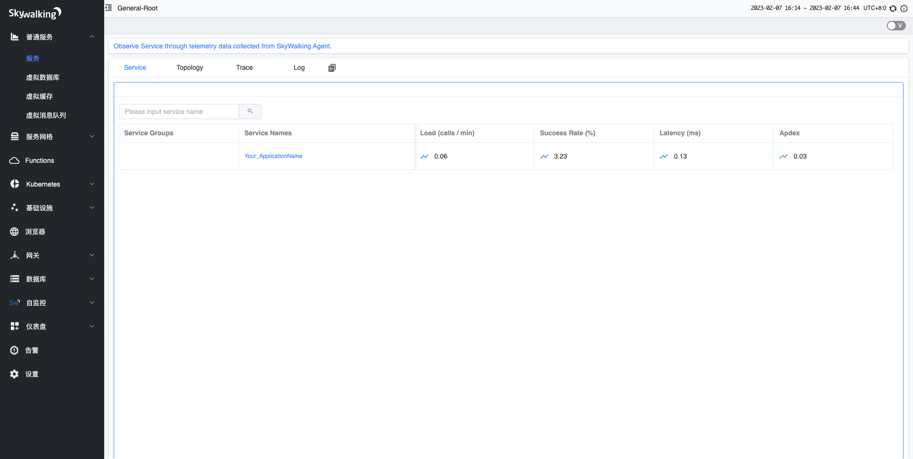
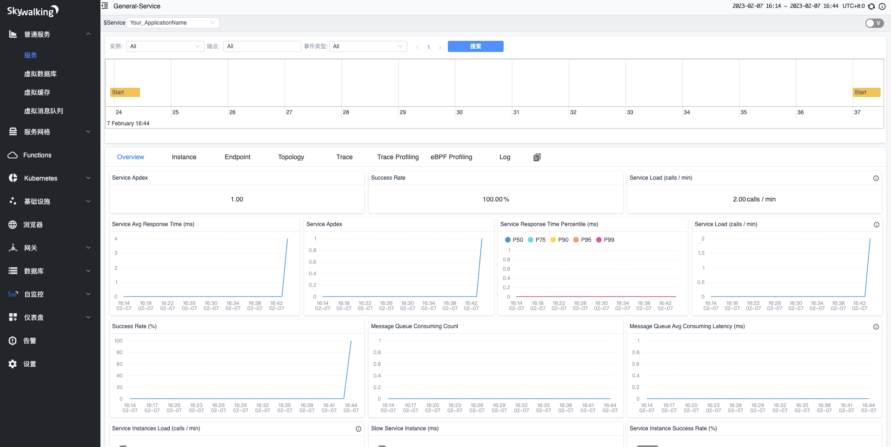
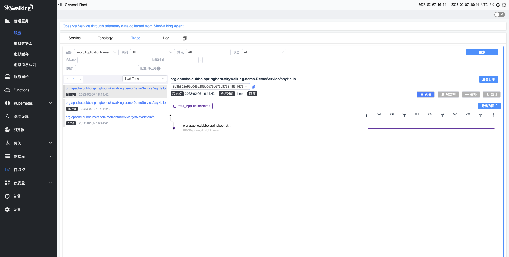

# Overview
Apache Dubbo has inbuilt tracing through [Micrometer Observations](https://micrometer.io/)
and [Micrometer Tracing](https://github.com/micrometer-metrics/tracing). 
And the micrometer can integrate with skywalking by [skywalking micrometer-1.10 api](https://skywalking.apache.org/docs/skywalking-java/next/en/setup/service-agent/java-agent/application-toolkit-micrometer-1.10/).

## 1. Adding Micrometer Observation To Your Project
In order to add Micrometer to the classpath and add metrics for Dubbo you need to add the `dubbo-metrics-api` dependency
as shown below:
```xml

<dependency>
    <groupId>org.apache.dubbo</groupId>
    <artifactId>dubbo-metrics-api</artifactId>
</dependency>
```

## 2. Add Skywalking Micrometer-1.10 Api To Your Project
To integrate the dubbo's micrometer tracing data to skywalking, you should add this toolkit dependency.
```xml
<dependency>
    <groupId>org.apache.skywalking</groupId>
    <artifactId>apm-toolkit-micrometer-1.10</artifactId>
</dependency>
```

## 3. Configuration ObservationRegistry
```java
@Configuration
public class ObservationConfiguration {
    @Bean
    ApplicationModel applicationModel(ObservationRegistry observationRegistry) {
        ApplicationModel applicationModel = ApplicationModel.defaultModel();
        observationRegistry.observationConfig()
                .observationHandler(new ObservationHandler.FirstMatchingCompositeObservationHandler(
                        new SkywalkingSenderTracingHandler(), new SkywalkingReceiverTracingHandler(),
                        new SkywalkingDefaultTracingHandler()
                ));
        applicationModel.getBeanFactory().registerBean(observationRegistry);
        return applicationModel;
    }
}
```
## 4. Start the Skywalking OAP
[skywalking oap setup](https://skywalking.apache.org/docs/main/v9.3.0/en/setup/backend/backend-setup/)
```shell
bash startup.sh
```
## 5. Start Provider and Application With Skywalking Agent
After starting the registration center, we start provider and Consumer with skywalking agent, so skywalking can report trace data.
And because skywalking java agent have instrumented the dubbo and spring framework, to verify dubbo integrates with skywalking by micrometer,
**we should delete plugin jars in "plugins" directory**.
To connect the skywalking oap, we should config the backend address in /path/to/skywalking-agent/agent.config.
The relevant field is **collector.backend_service**.
```shell
java -javaagent:/path/to/skywalking-agent/skywalking-agent.jar -jar dubbo-samples-spring-boot-tracing-skwalking-provider-1.0-SNAPSHOT.jar
```
```shell
java -javaagent:/path/to/skywalking-agent/skywalking-agent.jar -jar dubbo-samples-spring-boot-tracing-skwalking-consumer-1.0-SNAPSHOT.jar
```
## 6. Result
Open [skywalking-webapp](http://localhost:8080/) in browser.



