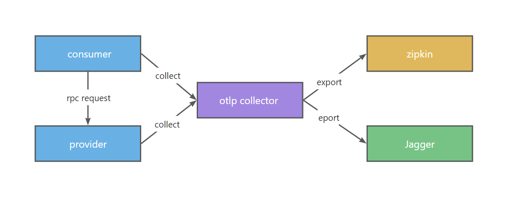
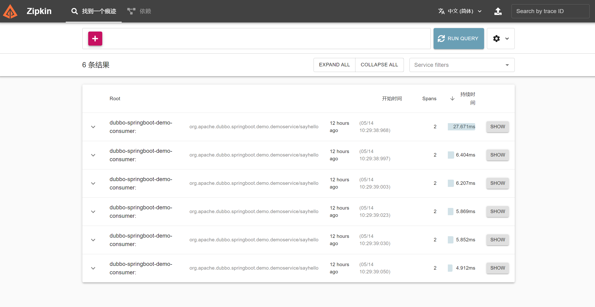
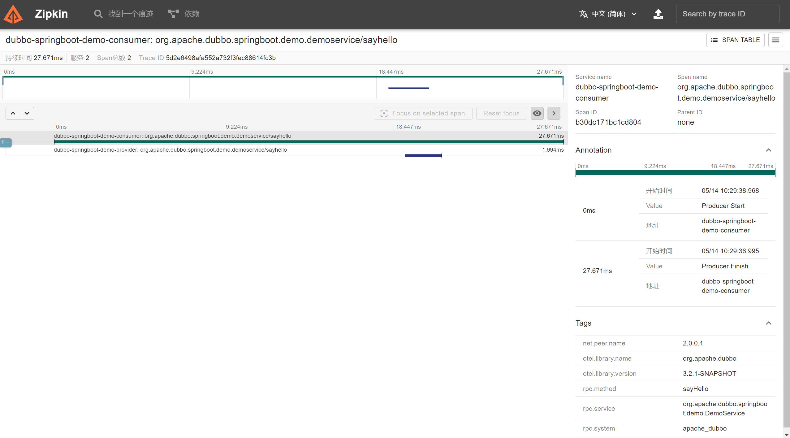
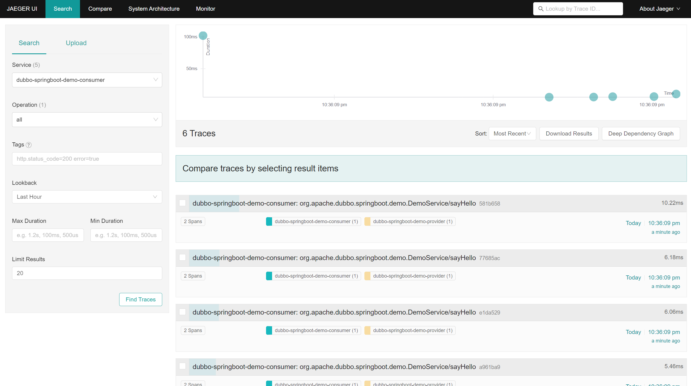
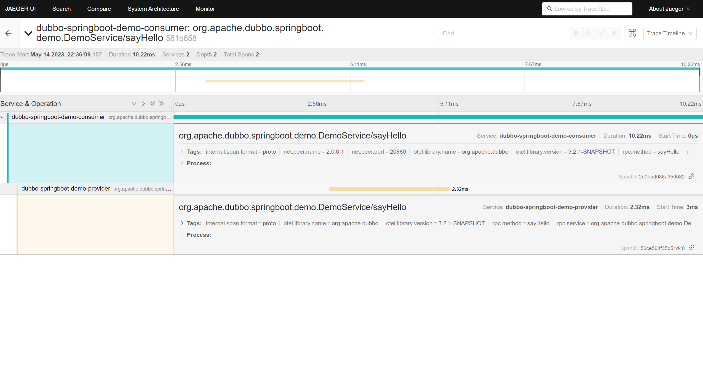

## 概述

这个案例展示了在 Dubbo 项目中以 Opentelemetry 作为 Tracer，将 Trace 信息上报到 Otlp Collector，再由 collector 转发至Zipkin、Jagger。

有三部分组成：

- dubbo-samples-spring-boot-tracing-otel-oltp-interface
- dubbo-samples-spring-boot-tracing-otel-oltp-provider
- dubbo-samples-spring-boot-tracing-otel-oltp-consumer

## 案例架构图



## 快速开始

### 安装 & 启动 Otlp Collector

按照 [Opentelemetry Collector Quick Start](https://opentelemetry.io/docs/collector/getting-started/) 去启动 otlp collector.

### 启动 Provider

直接运行`org.apache.dubbo.springboot.demo.provider.ProviderApplication` directly from IDE.

### 启动 Consumer

Start `org.apache.dubbo.springboot.demo.consumer.ConsumerApplication` directly from IDE.

### 查看 Trace 信息

在浏览器中打开zipkin看板 [http://localhost:9411/zipkin/](http://localhost:9411/zipkin/) :





在浏览器中打开Jaeger看板 [http://localhost:16686/search](http://localhost:16686/search) :





## 如何在项目中使用

### 1. 在你的项目中添加依赖

对于 SpringBoot 项目，你可以使用`dubbo-spring-boot-tracing-otel-otlp-starter` ：

```xml

<!-- Opentelemetry as Tracer, Otlp as exporter -->
<dependency>
    <groupId>org.apache.dubbo</groupId>
    <artifactId>dubbo-spring-boot-tracing-otel-otlp-starter</artifactId>
</dependency>
```

### 2. 配置

#### application.yml:

```yaml
dubbo:
  tracing:
    enabled: true # default is false
    sampling:
      probability: 0.5 # sampling rate, default is 0.1
    propagation:
      type: W3C # W3C/B3 default is W3C
    tracing-exporter:
      otlp-config:
        endpoint: http://localhost:4317
        timeout: 10s # default is 10s
        compression-method: none # none/gzip The method used to compress payloads, default is "none"
        headers: # customized added headers, default is empty
          auth: admin

# tracing info output to logging
logging:
  level:
    root: info
  pattern:
    console: '[%d{dd/MM/yy HH:mm:ss:SSS z}] %t %5p %c{2} [%X{traceId:-}, %X{spanId:-}]: %m%n'
```
