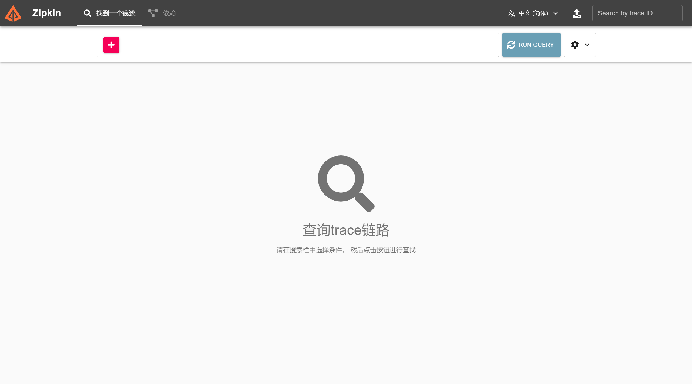
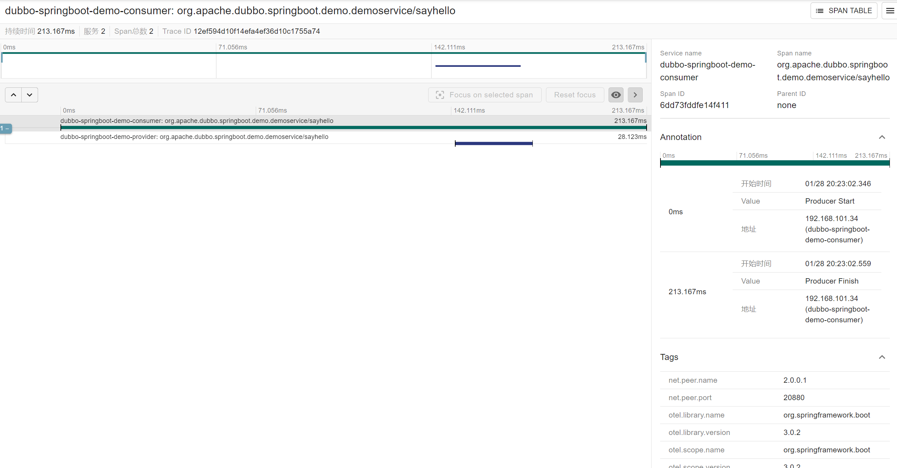

# Overview

This example demonstrates the basic usage of tracing in Dubbo application and report tracing information to zipkin. This
example contains three parts, `dubbo-samples-spring-boot3-tracing-provider`
, `dubbo-samples-spring-boot3-tracing-consumer` and `dubbo-samples-spring-boot3-tracing-interface`.

Apache Dubbo has inbuilt tracing through [Micrometer Observations](https://micrometer.io/)
and [Micrometer Tracing](https://github.com/micrometer-metrics/tracing).

## Quick Start

### Install & Start Zipkin

Follow [Zipkin's quick start](https://zipkin.io/pages/quickstart.html) to install zipkin.

Here we use docker to quickly start a zipkin server.

```bash
docker run -d -p 9411:9411 --name zipkin openzipkin/zipkin
```

Then you can verify zipkin server works by access [http://localhost:9411](http://localhost:9411)



### Install & Start Nacos

Follow [Nacos's quick start](https://nacos.io/zh-cn/docs/v2/quickstart/quick-start.html) to install and start nacos.

### Start Provider

Start `org.apache.dubbo.springboot.demo.provider.ProviderApplication` directly from IDE.

### Start Consumer

Start `org.apache.dubbo.springboot.demo.consumer.ConsumerApplication` directly from IDE.

### Check Result

Open [http://localhost:9411/zipkin/](http://localhost:9411/zipkin/) in browser.



## How To Use Dubbo Tracing In Your Project

### 1. Adding `dubbo-spring-boot-observability-starter` To Your Project

For the Springboot project, you can use `dubbo-spring-boot-observability-starter` to easily have observability:

```xml

<dependency>
    <groupId>org.apache.dubbo</groupId>
    <artifactId>dubbo-spring-boot-observability-starter</artifactId>
</dependency>
```

### 2. Adding Micrometer Tracing Bridge To Your Project

In order to start creating spans for Dubbo based projects a `bridge` between Micrometer Tracing and an actual Tracer is
required.

> NOTE: Tracer is a library that handles lifecycle of spans (e.g. it can create, start, stop, sample, report spans).

Micrometer Tracing supports  [OpenTelemetry](https://github.com/open-telemetry/opentelemetry-java)
and [Brave](https://github.com/openzipkin/brave) as Tracers. Dubbo recommends using OpenTelemetry as the protocol of
tracing, you can add dependency as shown below:

```xml
<!-- OpenTelemetry Tracer -->
<dependency>
    <groupId>io.micrometer</groupId>
    <artifactId>micrometer-tracing-bridge-otel</artifactId>
</dependency>
```

### 3. Adding Micrometer Tracing Exporter To Your Project

After having added the Tracer, an exporter (also known as a reporter) is required. It's a component that will export the
finished span and send it to a reporting system. Micrometer Tracer natively supports Tanzu Observability by Wavefront
and Zipkin. Let's take zipkin as an example as shown below:

OpenZipkin Zipkin with OpenTelemetry

```xml

<dependency>
    <groupId>io.opentelemetry</groupId>
    <artifactId>opentelemetry-exporter-zipkin</artifactId>
</dependency>
```

You can read more about tracing setup [this documentation, under docs/tracing](https://micrometer.io/).

### 4. Configuration Report Endpoint & Sampling Probability

#### Zipkin Server Endpoint:

```java

@Configuration
public class ObservationConfiguration {

    // zipkin endpoint url
    @Bean
    SpanExporter spanExporter() {
        return new ZipkinSpanExporterBuilder().setEndpoint("http://localhost:9411/api/v2/spans").build();
    }
}
```

#### Tracing Sampling Probability:

```yaml
dubbo:
  tracing:
    enabled: true
    sampling:
      probability: 0.5
      
# tracing info output to logging
logging:
  pattern:
    level: '%5p [${spring.application.name:},%X{traceId:-},%X{spanId:-}]'
```

### 5. Customizing Observation Filters

To customize the tags present in metrics (low cardinality tags) and in spans (low and high cardinality tags) you should
create your own versions of `DubboServerObservationConvention` (server side) and `DubboClientObservationConvention` (
client side) and register them in the `ApplicationModel`'s `BeanFactory`. To reuse the existing ones
check `DefaultDubboServerObservationConvention` (server side) and `DefaultDubboClientObservationConvention` (client
side).

## Extension

### Other Micrometer Tracing Bridge

```xml
<!-- Brave Tracer -->
<dependency>
    <groupId>io.micrometer</groupId>
    <artifactId>micrometer-tracing-bridge-brave</artifactId>
</dependency>
```

### Other Micrometer Tracing Exporter

Tanzu Observability by Wavefront

```xml

<dependency>
    <groupId>io.micrometer</groupId>
    <artifactId>micrometer-tracing-reporter-wavefront</artifactId>
</dependency>
```

OpenZipkin Zipkin with Brave

```xml

<dependency>
    <groupId>io.zipkin.reporter2</groupId>
    <artifactId>zipkin-reporter-brave</artifactId>
</dependency>
```

An OpenZipkin URL sender dependency to send out spans to Zipkin via a URLConnectionSender

```xml

<dependency>
    <groupId>io.zipkin.reporter2</groupId>
    <artifactId>zipkin-sender-urlconnection</artifactId>
</dependency>
```
