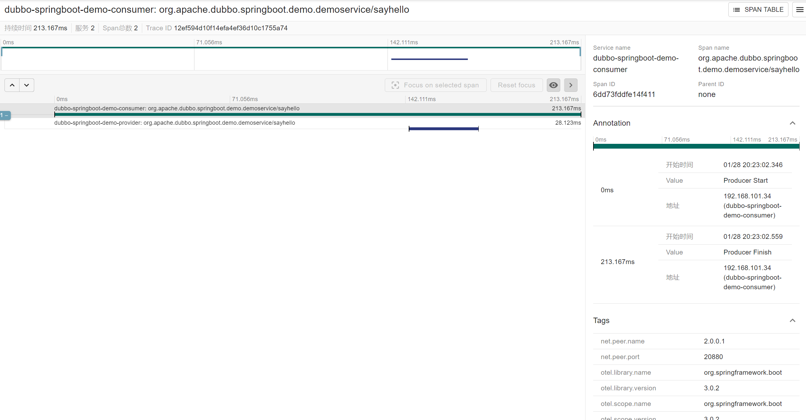

# Overview

Apache Dubbo has inbuilt tracing through [Micrometer Observations](https://micrometer.io/)
and [Micrometer Tracing](https://github.com/micrometer-metrics/tracing).

## 1. Adding Micrometer Observation To Your Project

In order to add Micrometer to the classpath and add metrics for Dubbo you need to add the `dubbo-metrics-api` dependency
as shown below:

```xml

<dependency>
    <groupId>org.apache.dubbo</groupId>
    <artifactId>dubbo-metrics-api</artifactId>
</dependency>
```

Thanks to the usage of [Micrometer Observations](https://micrometer.io/) Dubbo got instrumented once, but depending on
the setup will allow emission of metrics, tracer or other signals via custom `ObservationHandlers`. Please read
the [documentation under docs/observation](https://micrometer.io) for more information.

## 2. Adding Micrometer Tracing Bridge To Your Project

In order to start creating spans for Dubbo based projects a `bridge` between Micrometer Tracing and an actual Tracer is
required.

> NOTE: Tracer is a library that handles lifecycle of spans (e.g. it can create, start, stop, sample, report spans).

Micrometer Tracing supports [Brave](https://github.com/openzipkin/brave)
and [OpenTelemetry](https://github.com/open-telemetry/opentelemetry-java) as Tracers as shown below:

```xml

<!-- Brave Tracer -->
<dependency>
    <groupId>io.micrometer</groupId>
    <artifactId>micrometer-tracing-bridge-brave</artifactId>
</dependency>

        <!-- OpenTelemetry Tracer -->
<dependency>
<groupId>io.micrometer</groupId>
<artifactId>micrometer-tracing-bridge-otel</artifactId>
</dependency>
```

## 3. Adding Micrometer Tracing Exporter To Your Project

After having added the Tracer, an exporter (also known as a reporter) is required. It's a component that will export the
finished span and send it to a reporting system. Micrometer Tracer natively supports Tanzu Observability by Wavefront
and Zipkin as shown below:

Tanzu Observability by Wavefront

```xml

<dependency>
    <groupId>io.micrometer</groupId>
    <artifactId>micrometer-tracing-reporter-wavefront</artifactId>
</dependency>
```

OpenZipkin Zipkin with Brave

```xml

<dependency>
    <groupId>io.zipkin.reporter2</groupId>
    <artifactId>zipkin-reporter-brave</artifactId>
</dependency>
```

OpenZipkin Zipkin with OpenTelemetry

```xml

<dependency>
    <groupId>io.opentelemetry</groupId>
    <artifactId>opentelemetry-exporter-zipkin</artifactId>
</dependency>
```

An OpenZipkin URL sender dependency to send out spans to Zipkin via a URLConnectionSender

```xml

<dependency>
    <groupId>io.zipkin.reporter2</groupId>
    <artifactId>zipkin-sender-urlconnection</artifactId>
</dependency>
```

You can read more about tracing setup [this documentation, under docs/tracing](https://micrometer.io/).

## 4. Configuration ObservationRegistry

```java

@Configuration
public class ObservationConfiguration {

    // reuse the applicationModel in your system
    @Bean
    ApplicationModel applicationModel(ObservationRegistry observationRegistry) {
        ApplicationModel applicationModel = ApplicationModel.defaultModel();
        applicationModel.getBeanFactory().registerBean(observationRegistry);
        return applicationModel;
    }

    // zipkin endpoint url
    @Bean
    SpanExporter spanExporter() {
        return new ZipkinSpanExporterBuilder().setEndpoint("http://localhost:9411/api/v2/spans").build();
    }
}
```

## 5. Result

Start provider firstly, then start consumer.

Open [http://localhost:9411/zipkin/](http://localhost:9411/zipkin/) in browser.



## 6. Customizing Observation Filters

To customize the tags present in metrics (low cardinality tags) and in spans (low and high cardinality tags) you should
create your own versions of `DubboServerObservationConvention` (server side) and `DubboClientObservationConvention` (
client side) and register them in the `ApplicationModel`'s `BeanFactory`. To reuse the existing ones
check `DefaultDubboServerObservationConvention` (server side) and `DefaultDubboClientObservationConvention` (client
side).