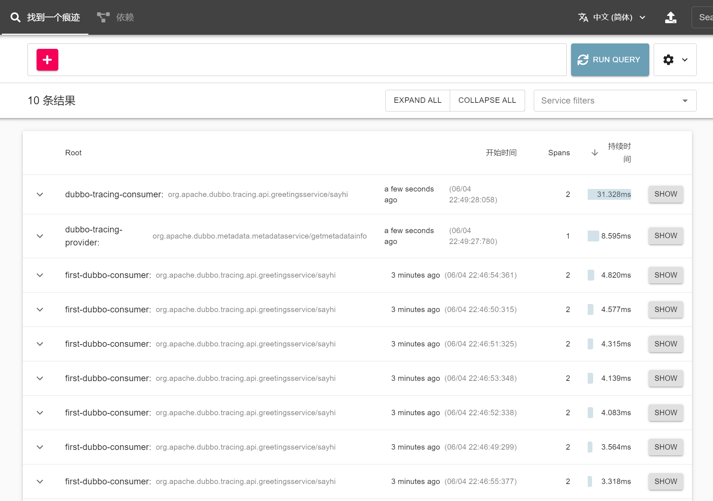
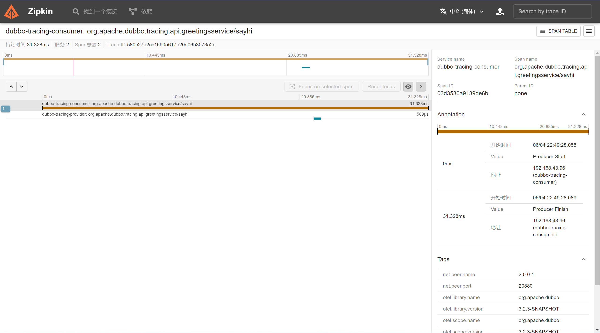

## 概述

这个案例展示了在以 api 形式使用 Dubbo 的项目中，以 Opentelemetry 作为 Tracer，将 Trace 信息上报到 Zipkin。

## 快速开始

### 安装 & 启动 Zipkin

按照 [Zipkin's quick start](https://zipkin.io/pages/quickstart.html) 去启动 Zipkin.

### 启动 Provider

直接在IDE中运行`org.apache.dubbo.tracing.provider.Application`.

### 启动 Consumer

直接在IDE中运行 `org.apache.dubbo.tracing.client.AlwaysApplication`.

### 查看 Trace 信息

在浏览器中打开zipkin看板 [http://localhost:9411/zipkin/](http://localhost:9411/zipkin/) :





## 如何在项目中使用

### 1. 在你的项目中添加依赖

对于以 api 形式使用的 Dubbo 项目，需自己选择 Tracer 和 Exporter 依赖引入：

参考一，以 Opentelemetry 作为 Tracer，上报到 Zipkin
```xml

    <!-- 必选，dubbo-tracing核心依赖 -->
    <dependency>
        <groupId>org.apache.dubbo</groupId>
        <artifactId>dubbo-tracing</artifactId>
    </dependency>
    <!-- Opentelemetry as Tracer -->
    <dependency>
        <groupId>io.micrometer</groupId>
        <artifactId>micrometer-tracing-bridge-otel</artifactId>
    </dependency>
    <!-- Zipkin as exporter -->
    <dependency>
        <groupId>io.opentelemetry</groupId>
        <artifactId>opentelemetry-exporter-zipkin</artifactId>
    </dependency>
```

参考二，以 Opentelemetry 作为 Tracer，上报到 OTlp
```xml

    <!-- 必选，dubbo-tracing核心依赖 -->
    <dependency>
        <groupId>org.apache.dubbo</groupId>
        <artifactId>dubbo-tracing</artifactId>
    </dependency>
    <!-- Opentelemetry as Tracer -->
    <dependency>
        <groupId>io.micrometer</groupId>
        <artifactId>micrometer-tracing-bridge-otel</artifactId>
    </dependency>
    <!-- OTlp as exporter -->
    <dependency>
        <groupId>io.opentelemetry</groupId>
        <artifactId>opentelemetry-exporter-otlp</artifactId>
    </dependency>
```

### 2. 配置

```java
public class TracingConfigProvider {

    public static TracingConfig getTracingConfig() {
        TracingConfig tracingConfig = new TracingConfig();
        // 开启dubbo tracing
        tracingConfig.setEnabled(true);
        // 设置采样率
        tracingConfig.setSampling(new SamplingConfig(1.0f));
        // 设置Propagation，默认为W3C，可选W3C/B3
        tracingConfig.setPropagation(new PropagationConfig("W3C"));
        // 设置trace上报
        ExporterConfig exporterConfig = new ExporterConfig();
        // 设置将trace上报到Zipkin
        exporterConfig.setZipkin(new ExporterConfig.ZipkinConfig("http://localhost:9411/api/v2/spans"));
        tracingConfig.setExporter(exporterConfig);
        return tracingConfig;
    }
}
```
