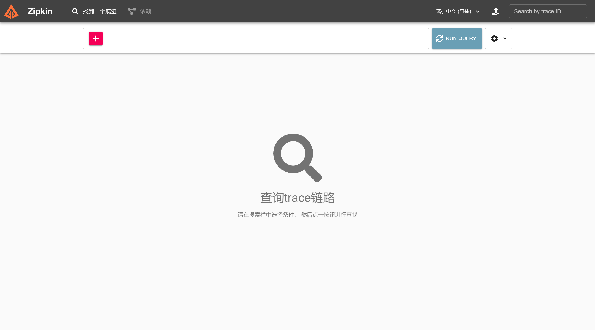

# Overview

This example demonstrates the basic usage of tracing in Dubbo application and report tracing information to zipkin. This
example contains three parts, `dubbo-samples-spring-boot-tracing-provider`
, `dubbo-samples-spring-boot-tracing-consumer` and `dubbo-samples-spring-boot-tracing-interface`.

Apache Dubbo has inbuilt tracing through [Micrometer Observations](https://micrometer.io/)
and [Micrometer Tracing](https://github.com/micrometer-metrics/tracing).

## Quick Start

### Install & Start Zipkin

Follow [Zipkin's quick start](https://zipkin.io/pages/quickstart.html) to install zipkin.

Here we use docker to quickly start a zipkin server.

```bash
docker run -d -p 9411:9411 --name zipkin openzipkin/zipkin
```

Then you can verify zipkin server works by access [http://localhost:9411](http://localhost:9411)



### Start Provider

Start `org.apache.dubbo.springboot.demo.provider.ProviderApplication` directly from IDE.

### Start Consumer

Start `org.apache.dubbo.springboot.demo.consumer.ConsumerApplication` directly from IDE.

### Check Result

Open [http://localhost:9411/zipkin/](http://localhost:9411/zipkin/) in browser.


## How To Use Dubbo Tracing In Your Project

### 1. Adding `dubbo-spring-boot-observability-starter` To Your Project

For the Springboot project, you can use `dubbo-spring-boot-observability-starter` to easily have observability, Dubbo
provides two types of starters at present, select one to add to pom:

```xml

<!-- Opentelemetry as Tracer, Zipkin as exporter -->
<dependency>
    <groupId>org.apache.dubbo</groupId>
    <artifactId>dubbo-spring-boot-tracing-otel-zipkin-starter</artifactId>
</dependency>
```

```xml

<!-- Brave as Tracer, Zipkin as exporter -->
<dependency>
    <groupId>org.apache.dubbo</groupId>
    <artifactId>dubbo-spring-boot-tracing-brave-zipkin-starter</artifactId>
</dependency>
```

Dubbo will support more in the future, such as skywalking, Jagger.

### 2. Configuration Tracing

#### application.yml:

```yaml
dubbo:
  tracing:
    enabled: true # default is false
    sampling:
      probability: 0.5 # sampling rate, default is 0.1
    propagation:
      type: W3C # W3C/B3 default is W3C
    tracing-exporter:
      zipkin-config:
        endpoint: http://localhost:9411/api/v2/spans
        connect-timeout: 1s # connect timeout, default is 1s
        read-timeout: 10s # read timeout, default is 10s

# tracing info output to logging
logging:
  level:
    root: info
  pattern:
    console: '[%d{dd/MM/yy HH:mm:ss:SSS z}] %t %5p %c{2} [%X{traceId:-}, %X{spanId:-}]: %m%n'
```

### 3. Customizing Observation Filters

To customize the tags present in metrics (low cardinality tags) and in spans (low and high cardinality tags) you should
create your own versions of `DubboServerObservationConvention` (server side) and `DubboClientObservationConvention` (
client side) and register them in the `ApplicationModel`'s `BeanFactory`. To reuse the existing ones
check `DefaultDubboServerObservationConvention` (server side) and `DefaultDubboClientObservationConvention` (client
side).

## Extension

An OpenZipkin URL sender dependency to send out spans to Zipkin via a URLConnectionSender

```xml

<dependency>
    <groupId>io.zipkin.reporter2</groupId>
    <artifactId>zipkin-sender-urlconnection</artifactId>
</dependency>
```