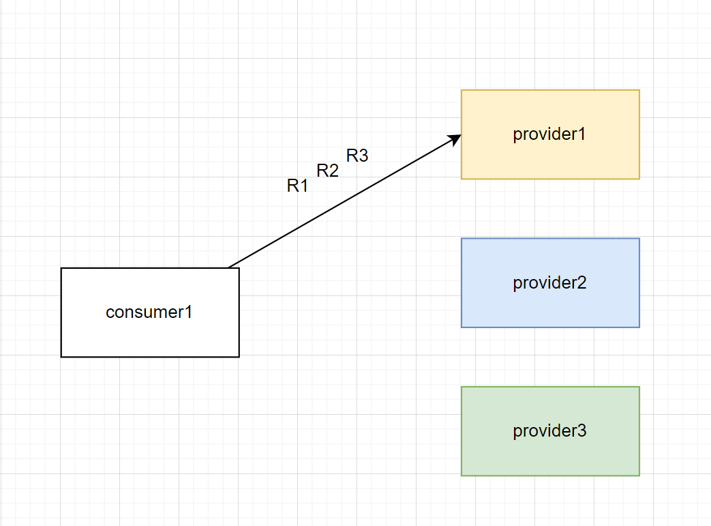

# Dubbo mesh using Istio

可以按照下文步骤，将 Demo 部署到本地集群。

* [1 总体目标](#target)
* [2 基本流程](#basic)
* [3 详细步骤](#detail)
    + [3.1 环境要求](#env)
    + [3.2 前置条件](#prepare)
    + [3.3 部署到 Kubernetes](#deploy)
        - [3.4.1 部署 Provider](#deploy_provider)
        - [3.4.2 部署 Consumer](#deploy_consumer)
    + [3.5 检查 Provider 和 Consumer 正常通信](#check)
* [4 配置健康检查](#health_check)
    + [4.1 Istio 服务的健康检查](#health_check_istio)
    + [4.2 Envoy 主动健康检查](#health_check_envoy)
* [5 修改示例与镜像打包](#5-修改示例与镜像打包)
* [6 下一步计划](#next)
* [7 常用命令](#common)

<h2 id="target">1 总体目标</h2>

* 部署 Dubbo 应用到 Kubernetes
* Istio 实现服务发现
* Istio 自动注入 Envoy 并实现流量拦截
* 基于 EnvoyFilter 对 consumer 的上游集群做主动健康检查

<h2 id="basic">2 基本流程与工作原理</h2>
这个示例演示了如何将 Dubbo 开发的应用部署在 Istio 体系下，以实现 Envoy 对 Dubbo 服务的自动代理，示例总体架构如下图所示。

[thinsdk](./assets/thinsdk.png)

完成示例将需要的步骤如下：

1. 创建一个 Dubbo 应用( [dubbo-samples-mesh-k8s](https://github.com/apache/dubbo-samples/tree/master/dubbo-samples-mesh-k8s) )
2. 构建容器镜像并推送到镜像仓库（ [dubbomesh 示例镜像](https://hub.docker.com/u/15841721425) ）
3. 分别部署 Dubbo Provider 与 Dubbo Consumer 到 Kubernetes 并验证 Envoy 代理注入成功
4. 验证 Envoy 发现服务地址、正常拦截 RPC 流量并实现负载均衡
5. 优化并配置健康检查流程

<h2 id="detail">3 详细步骤</h2>

<h3 id="env">3.1 环境要求</h3>

请确保本地安装如下环境，以提供容器运行时、Kubernetes集群及访问工具

* [Docker](https://www.docker.com/get-started/)
* [Minikube](https://minikube.sigs.k8s.io/docs/start/)
* [Kubectl](https://kubernetes.io/docs/tasks/tools/)
* [Istio](https://istio.io/latest/docs/setup/getting-started/)
* [Kubens(optional)](https://github.com/ahmetb/kubectx)

通过以下命令启动本地 Kubernetes 集群

```shell
minikube start
```

通过 kubectl 检查集群正常运行，且 kubectl 绑定到默认本地集群

```shell
kubectl cluster-info
```

<h3 id="prepare">3.2 前置条件</h3>

由于示例 Dubbo 项目均部署在 Pod 中且与 API-SERVER 有交互，因此有相应的权限要求，我们这里创建独立 ServiceAccount 并绑定必须的 Roles，后面所有的 Dubbo Kubernetes
资源都将使用这里新建的 ServiceAccount。

通过以下命令我们创建了独立的 Namespace `dubbo-demo` 与 ServiceAccount `dubbo-sa`。

```shell
# 初始化命名空间
kubectl apply -f https://raw.githubusercontent.com/apache/dubbo-samples/master/dubbo-samples-mesh-k8s/deploy/Namespace.yml

# 切换命名空间
kubens dubbo-demo

# dubbo-demo 开启自动注入
kubectl label namespace dubbo-demo istio-injection=enabled

```

<h3 id="deploy">3.4 部署到 Kubernetes</h3>

<h4 id="deploy_provider">3.4.1 部署 Provider</h3>

```shell
# 部署 Service
kubectl apply -f https://raw.githubusercontent.com/apache/dubbo-samples/master/dubbo-samples-mesh-k8s/deploy/provider/Service.yml

# 部署 Deployment
kubectl apply -f https://raw.githubusercontent.com/apache/dubbo-samples/master/dubbo-samples-mesh-k8s/deploy/provider/Deployment.yml
```

以上命令创建了一个名为 `dubbo-samples-mesh-provider` 的 Service，注意这里的 service name 与项目中的 dubbo 应用名是一样的。

同时 Service 里也包含 VirtualService 和 DestinationRule，是对 provider
的流量进行治理，详细配置可参考[VirtualService 配置](https://istio.io/latest/zh/docs/reference/config/networking/virtual-service/)
、[DestinationRule 配置](https://istio.io/latest/zh/docs/reference/config/networking/destination-rule/)。

接着 Deployment 部署了一个 2 副本的 pod 实例，至此 Provider 启动完成。

可以通过如下命令检查启动日志。

```shell
# 查看 pod 列表
kubectl get pods -l app=dubbo-samples-mesh-provider

# 查看 pod 部署日志
kubectl logs your-pod-id
```

这时 pod 中应该有一个 dubbo provider 容器实例，同时还有一个 Envoy Sidecar 容器实例。

<h4 id="deploy_consumer">3.4.2 部署 Consumer</h3>

```shell
# 部署 Service
kubectl apply -f https://raw.githubusercontent.com/apache/dubbo-samples/master/dubbo-samples-mesh-k8s/deploy/consumer/Service.yml

# 部署 Deployment
kubectl apply -f https://raw.githubusercontent.com/apache/dubbo-samples/master/dubbo-samples-mesh-k8s/deploy/consumer/Deployment.yml
```

部署 consumer 与 provider 是一样的，这里也保持了 K8S Service 与 Dubbo consumer Application Name 一致： `dubbo.application.name=dubbo-samples-mesh-consumer`。

> Dubbo Consumer 服务声明中还指定了消费的 Provider 服务（应用）名 `@DubboReference(version = "1.0.0", providedBy = "dubbo-samples-mesh-provider", lazy = true)`

<h3 id="check">3.5 检查 Provider 和 Consumer 正常通信</h3>

继执行 3.4 步骤后， 检查启动日志，查看 consumer 完成对 provider 服务的消费。

```shell
# 查看 pod 列表
kubectl get pods -l app=dubbo-samples-mesh-consumer

# 查看 pod 部署日志
kubectl logs your-pod-id

# 查看 pod isitio-proxy 日志
kubectl logs your-pod-id -c istio-proxy
```

可以看到 consumer pod 日志输出如下( Triple 协议被 Envoy 代理负载均衡):

```bash
[15/07/22 11:37:50:050 UTC] main  INFO action.GreetingServiceConsumer: consumer Unary reply <-message: 
"hello,service mesh, response from provider: 172.17.0.11:50052, client: 172.17.0.11, local: dubbo-samples-mesh-provider, remote: null, isProviderSide: true"

==================== dubbo invoke 1513 end ====================
[15/07/22 11:38:00:000 UTC] main  INFO action.GreetingServiceConsumer: consumer Unary reply <-message: 
"hello,service mesh, response from provider: 172.17.0.8:50052, client: 172.17.0.8, local: dubbo-samples-mesh-provider, remote: null, isProviderSide: true"

==================== dubbo invoke 1514 end ====================
[15/07/22 11:38:10:010 UTC] main  INFO action.GreetingServiceConsumer: consumer Unary reply <-message: 
"hello,service mesh, response from provider: 172.17.0.6:50052, client: 172.17.0.6, local: dubbo-samples-mesh-provider, remote: null, isProviderSide: true"

==================== dubbo invoke 1515 end ====================
```

consumer istio-proxy 日志输出如下:

```shell
[2022-07-15T05:35:14.418Z] "POST /org.apache.dubbo.samples.Greeter/greet HTTP/2" 200 
- via_upstream - "-" 19 160 2 1 "-" "-" "6b8a5a03-5783-98bf-9bee-f93ea6e3d68e" 
"dubbo-samples-mesh-provider:50052" "172.17.0.4:50052" 
outbound|50052||dubbo-samples-mesh-provider.dubbo-demo.svc.cluster.local 172.17.0.7:52768 10.101.172.129:50052 172.17.0.7:38488 - default
```

可以看到 provider pod 日志输出如下:

```shell
[22/06/22 08:22:36:036 UTC] Dubbo-protocol-50052-thread-8  INFO impl.GreeterImpl: 
Server test dubbo tri k8s received greet request name: "Kubernetes Api Server"
```

provider istio-proxy 日志输出如下:

```shell
[2022-07-15T05:25:34.061Z] "POST /org.apache.dubbo.samples.Greeter/greet HTTP/2" 200 
- via_upstream - "-" 19 162 1 1 "-" "-" "201e6976-da10-96e1-8da7-ad032e58db47" 
"dubbo-samples-mesh-provider:50052" "172.17.0.10:50052"
 inbound|50052|| 127.0.0.6:47013 172.17.0.10:50052 172.17.0.7:60244
  outbound_.50052_._.dubbo-samples-mesh-provider.dubbo-demo.svc.cluster.local default
```

<h2 id="health_check">4 健康检查</h2>

<h3 id="health_check_istio">4.1 Istio 服务的健康检查</h3>

Pod 的生命周期 与服务调度息息相关，通过对 Kubernetes 官方探针的实现，能够使 Dubbo 乃至整个应用的生命周期与 Pod 的生命周期对齐。

**存活检测**

对于 livenessProbe 存活检测，由于 Dubbo 框架本身无法获取到应用的存活状态，因此本接口无默认实现，且默认返回成功。开发者可以根据 SPI 定义对此 SPI 接口进行拓展，从应用层次对是否存活进行判断。

**就绪检测**

对于 readinessProbe 就绪检测，目前 Dubbo 默认提供了两个检测维度，一是对 Dubbo 服务自身是否启停做判断，另外是对所有服务是否存在已注册接口，如果所有服务均已从注册中心下线（可以通过 QOS
运维进行操作）将返回未就绪的状态。（readinessProbe 目前 dubbo 实现方式不适用于 mesh，mesh 模式不配置注册中心，dubbo 的 readinessProbe 会返回 false）

**启动检测**

对于 startupProbe 启动检测，目前Dubbo 默认提供了一个检测维度，即是在所有启动流程（接口暴露、注册中心写入等）均结束后返回已就绪状态。

**使用方法：**

参考配置(具体可以参考 [dubbo-samples-mesh-provider 的配置文件](#properties))

```yaml
livenessProbe:
  httpGet:
    path: /live
    port: 22222
  initialDelaySeconds: 5
  periodSeconds: 5
readinessProbe:
  httpGet:
    path: /ready
    port: 22222
  initialDelaySeconds: 5
  periodSeconds: 5
startupProbe:
  httpGet:
    path: /startup
    port: 22222
  failureThreshold: 30
  periodSeconds: 10
```

<h3 id="health_check_envoy">4.2 Envoy 主动健康检查</h3>

本次从 consumer 侧的 Envoy ，对其上游集群 provider 做主动健康检查(GRPC)。

配置EnvoyFilter如下：

```yaml
apiVersion: networking.istio.io/v1alpha3
kind: EnvoyFilter
metadata:
  name: cluster
  namespace: dubbo-demo
spec:
  workloadSelector:
    labels:
      app: dubbo-samples-mesh-consumer
  configPatches:
    - applyTo: CLUSTER
      match:
        cluster:
          name: outbound|50052||dubbo-samples-mesh-provider.dubbo-demo.svc.cluster.local
      patch:
        operation: MERGE
        value:
          health_checks:
            - timeout: 5s
              interval: 5s
              initial_jitter: 1s
              interval_jitter: 1s
              interval_jitter_percent: 50
              unhealthy_threshold: 1
              healthy_threshold: 1
              reuse_connection: true
              no_traffic_interval: 2s
              no_traffic_healthy_interval: 4s
              unhealthy_interval: 5s
              unhealthy_edge_interval: 10s
              healthy_edge_interval: 10s
              tls_options:
                alpn_protocols:
                  - http1.1
                  - h2
              transport_socket_match_criteria:
                useMTLS: true
              grpc_health_check:
                authority: dubbo-samples-mesh-provider.dubbo-demo.svc.cluster.local
```

Envoy健康检查的配置说明(
详见[Envoy 健康检查文档](https://www.envoyproxy.io/docs/envoy/latest/api-v3/config/core/v3/health_check.proto#envoy-v3-api-msg-config-core-v3-healthcheck)):

```yaml
{
  "timeout": "{...}",超时时间
  "interval": "{...}",检测间隔
  "initial_jitter": "{...}",初始抖动
  "interval_jitter": "{...}",间隔抖动
  "interval_jitter_percent": "...",间隔抖动比例
  "unhealthy_threshold": "{...}",不健康阈值
  "healthy_threshold": "{...}",健康阈值
  "reuse_connection": "{...}",重用连接
  "http_health_check": "{...}",http类型健康检测
  "tcp_health_check": "{...}",tcp类型健康检测
  "grpc_health_check": "{...}",grpc类型健康检测
  "custom_health_check": "{...}",自定义健康检测
  "no_traffic_interval": "{...}",没有流量时的间隔
  "no_traffic_healthy_interval": "{...}",没有流量健康后的间隔
  "unhealthy_interval": "{...}",不健康的间隔
  "unhealthy_edge_interval": "{...}",不健康边缘间隔
  "healthy_edge_interval": "{...}",健康边缘间隔
  "event_log_path": "...",日志路径
  "always_log_health_check_failures": "...",失败总是记录日志
  "tls_options": "{...}",选项
  "transport_socket_match_criteria": "{...}"trasport_socket匹配条件
}
```

**实验结果**

- 首先按照步骤 3.4 启动好 provider 和 consumer。

运行 `kubectl apply -f https://raw.githubusercontent.com/apache/dubbo-samples/master/dubbo-samples-mesh-k8s/deploy/EnvoyFilter.yml`

- 随后查看 provider 侧的 istio-proxy 日志，可观察到 provider 接收到 GRPC 健康检查：

```bash
[2022-07-08T09:03:34.152Z] "POST /grpc.health.v1.Health/Check HTTP/2" 200 - via_upstream
 - "-" 5 7 5 5 "-" "Envoy/HC" "b33a9988-2c15-99b0-be0c-e085b64d77fa" "dubbo-samples-mesh-provider.dubbo-demo.svc.cluster.local" "172.17.0.7:50052" 
 inbound|50052|| 127.0.0.6:44823 172.17.0.7:50052 172.17.0.8:53858 - default
```

**参考：**

- [Dubbo 探针文档](https://dubbo.apache.org/zh/docs/v3.0/references/lifecycle/brief/)
- [Istio 服务的健康检查官方文档](https://istio.io/latest/zh/docs/ops/configuration/mesh/app-health-check/)
- [Envoy 健康检查文档](https://www.envoyproxy.io/docs/envoy/latest/api-v3/config/core/v3/health_check.proto#envoy-v3-api-msg-config-core-v3-healthcheck)


<h3 id="image">5 修改示例与镜像打包（仅在修改示例并重新打包时需要）</h3>

> 1. 注意项目存储路径一定是英文，否则 protobuf 编译失败。
> 2. 以为应用开发与打包的指引说明。

修改 Dubbo Provider 配置 `dubbo-provider.properties`

```properties
# provider
dubbo.application.name=dubbo-samples-mesh-provider
dubbo.application.metadataServicePort=20885
dubbo.registry.address=N/A
dubbo.protocol.name=tri
dubbo.protocol.port=50052
dubbo.application.qosEnable=true
# 为了使 Kubernetes 集群能够正常访问到探针，需要开启 QOS 允许远程访问，此操作有可能带来安全风险，请仔细评估后再打开
dubbo.application.qosAcceptForeignIp=true

```

修改 Dubbo Consumer 配置 `dubbo-consumer.properties`

```properties
# consumer
dubbo.application.name=dubbo-samples-mesh-consumer
dubbo.application.metadataServicePort=20885
dubbo.registry.address=N/A
dubbo.protocol.name=tri
dubbo.protocol.port=20880
dubbo.consumer.timeout=30000
dubbo.application.qosEnable=true
# 为了使 Kubernetes 集群能够正常访问到探针，需要开启 QOS 允许远程访问，此操作有可能带来安全风险，请仔细评估后再打开
dubbo.application.qosAcceptForeignIp=true

```

完成代码修改后，通过项目提供的 Dockerfile 打包镜像

```shell
# 打包并推送镜像
mvn compile jib:build
```

> Jib 插件会自动打包并发布镜像。注意，本地开发需将 jib 插件配置中的 docker registry 组织 dubboteam 改为自己有权限的组织（包括其他 kubernetes manifests 中的 dubboteam 也要修改，以确保 kubernetes 部署的是自己定制后的镜像），如遇到 jib 插件认证问题，请参考[相应链接](https://github.com/GoogleContainerTools/jib/blob/master/docs/faq.md#what-should-i-do-when-the-registry-responds-with-unauthorized)配置 docker registry 认证信息。


<h2 id="next">6 下一步计划</h2>

TODO

* 探索envoy和istio支持的服务治理的内容，比如开发者需要实现重试，API处要传什么值。
* 解决目前readinessProbe不适用mesh模式的问题
* 精简SDK。

## 工作原理说明

grpc 通过 HTTP/2 运行，与通过 HTTP/1.1 运行相比具有若干优点，例如高效的二进制编码显著降低序列化成本，通过单个连接复用请求和响应减少 TCP 管理开销，以及自动类型检查。
但是kubernetes的默认负载平衡通常不能对grpc起到作用，需要添加其他grpc负载均衡服务。

- 为什么 grpc 需要特殊的负载均衡

因为 grpc 构建在HTTP/2上，而 HTTP/2 被设计为具有单个长期 TCP
连接，所有请求都被多路复用，意味着多个请求可以在任何时间点在同一连接上处于活动状态。这减少了连接管理开销，但也意味着连接级的均衡没有作用。一旦建立连接，就不再需要进行平衡。所有的请求都将固定到单个目标实例上，如下所示：

<div style="text-align: center"></div>

Kubernetes 的 kube-proxy 本质上是一个L4负载平衡器，因此我们不能依靠它来平衡微服务之间的gRPC调用。

使用 Envoy 就可以优雅的解决上诉问题。 详细配置在 Service.yml 中，其中：

- grpc对应的服务端口，name要加 **grpc-** 前缀；
- Service不能配置成Headless服务。

<h2 id="common">7 常用命令</h2>

```shell
# dump current Envoy configs
kubectl exec -it ${your pod id} -c istio-proxy curl http://127.0.0.1:15000/config_dump > config_dump

# 进入 istio-proxy 容器
kubectl exec -it ${your pod id} -c istio-proxy -- /bin/bash

# 查看容器日志
kubectl logs ${your pod id} -n ${your namespace}

kubectl logs ${your pod id} -n ${your namespace} -c istio-proxy

# 开启自动注入sidecar
kubectl label namespace ${your namespace} istio-injection=enabled --overwrite

# 关闭自动注入sidecar
kubectl label namespace ${your namespace} istio-injection=disabled --overwrite
```