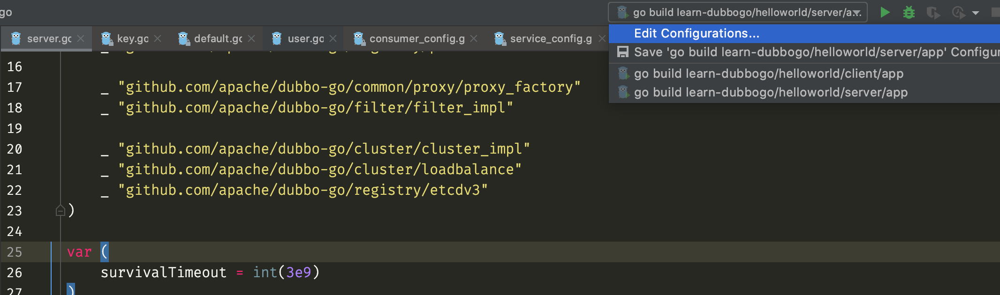
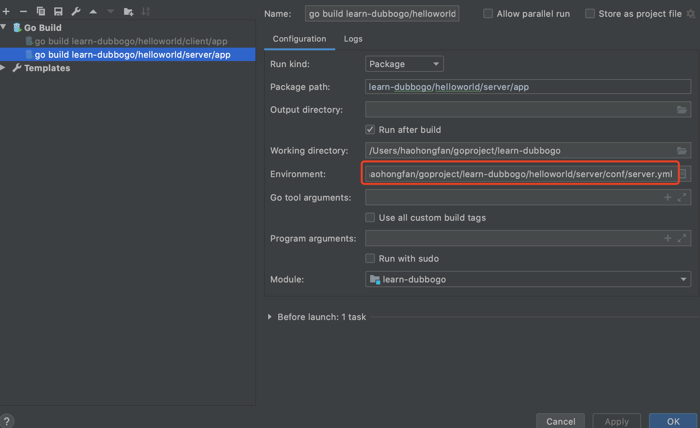

# examples

Examples of dubbo-go

## What does this contain

* helloworld

    A simplest example. It contain 'go-client', 'go-server', 'java-server' of dubbo protocol. 
    
* direct

    A direct example. This feature make start of dubbo-go get easy. 
    
* async

    An async example. dubbo-go supports client to call server asynchronously. 

* general

    A general example. It had validated zookeeper registry and different parameter lists of service. 
  And it has a comprehensive testing with dubbo/jsonrpc/grpc/rest protocol. You can refer to it to create your first complete dubbo-go project.

* generic

    A generic example. It show how to use generic feature of dubbo-go.

* configcenter

    Some examples of different config center. There are three -- zookeeper, apollo and nacos at present.

* multi_registry

    An example of multiple registries.

* registry

    Some examples of different registry. There are kubernetes, nacos and etcd at present.

	**Note**:

	When use different registry, you need update config file, but also must import the registry package. see the etcd `README`

* filter

    Some examples of different filter. Including custom_filter and tpslimit
    
* router

    Some router examples. Now, a condition router example is existing. 

* seata

    Transaction system examples by seata.

* shop    

    Shop sample, make consumer and provider run in a go program.
        
* tracing

    Some tracing examples. We have tracing support of dubbo/grpc/jsonrpc protocol at present. 

## How to build and run

> Take `helloworld` as an example
java server

```bash
cd helloworld/dubbo/java-server
sh build.sh
cd ./target
tar -zxvf user-info-server-0.2.0-assembly.tar.gz
cd ./user-info-server-0.2.0
sh ./bin/server.sh start
```

java client

```bash
cd helloworld/dubbo/java-client
sh build.sh
cd ./target
tar -zxvf user-info-client-0.2.0-assembly.tar.gz
cd ./user-info-client-0.2.0
sh ./bin/server.sh start
```

go server

* $ARCH = [linux, mac, windows] and $ENV = [dev, release, test]

```bash
cd helloworld/dubbo/go-server
sh ./assembly/$ARCH/$ENV.sh
cd ./target/$ARCH/user_info_server-0.3.1-20190517-0930-release
# $SUFFIX is a suffix of config file,
# such as server_zookeeper.yml when $SUFFIX is "zookeeper", 
# if $SUFFIX = "", default server.yml
sh ./bin/load.sh start $SUFFIX
```

go client

* $ARCH = [linux, mac, windows] and $ENV = [dev, release, test]

```bash
cd helloworld/dubbo/go-client
sh ./assembly/$ARCH/$ENV.sh
cd ./target/$ARCH/user_info_client-0.3.1-20190517-0921-release
# $SUFFIX is a suffix of config file,
# such as client_zookeeper.yml when $SUFFIX = zookeeper", 
# if $SUFFIX = "", config file is client.yml
sh ./bin/load_user_info_client.sh start $SUFFIX
```

docker env

```bash
docker run -d --name zk zookeeper
docker run -d --network container:zk registry.cn-hangzhou.aliyuncs.com/scottwang/go-server
docker run -d --network container:zk registry.cn-hangzhou.aliyuncs.com/scottwang/go-client
```

## How to debug with Goland

### Edit Configurations



### Configure `Environment Variable`

1. Add `APP_LOG_CONF_FILE`. eg: `/home/xx/dubbogo-samples/helloworld/client/conf/log.yml`
2. Add `CONF_CONSUMER_FILE_PATH` eg: `/home/xx/dubbogo-samples/helloworld/client/conf/client.yml`
3. Add `CONF_PROVIDER_FILE_PATH` eg: `/home/xx/dubbogo-samples/helloworld/server/conf/server.yml`


	
### Apply & Run

## How to contribute

If you want to add some samples, we hope that you can do this:
1. Adding samples in appropriate directory. If you dont' know which directory you should put your samples into, you can get some advices from dubbo-go community.
2. You must run the samples locally and there must be no any error.
3. If your samples have some third party dependency, including another framework, we hope that you can provide some docs, script is better.
4. Please make pr to https://github.com/dubbogo/dubbo-samples instead of https://github.com/apache/dubbo-samples. We will synchronize to apache/dubbo-samples regularly.
